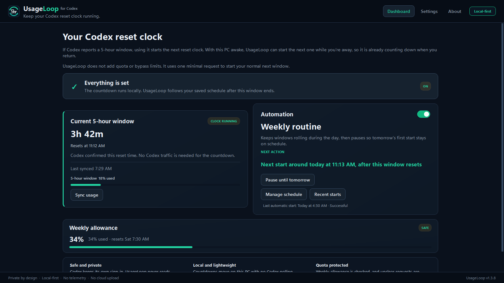

# UsageLoop

[](https://github.com/benthompsondev/usageloop/releases/latest) [](https://github.com/benthompsondev/usageloop/actions/workflows/verify.yml) [](LICENSE)

**Keep your Codex 5-hour reset clock moving while you’re away.**

UsageLoop is a local-first Windows app, with a Linux beta available for testing.
It shows whether your Codex reset clock is running and can start the normal next
window while you’re away.
UsageLoop does not add quota or bypass limits. It starts the normal next window
you were going to receive anyway.

**[Download for Windows — Stable](https://github.com/benthompsondev/usageloop/releases/download/v1.1.2/UsageLoop-Setup.exe)**
· **[Download for Linux — Beta](https://github.com/benthompsondev/usageloop/releases/tag/v1.1.0-beta.1)**
· [Windows release notes](https://github.com/benthompsondev/usageloop/releases/tag/v1.1.2)
· [Report a problem](https://github.com/benthompsondev/usageloop/issues/new?template=bug_report.yml)



- Native x64-compatible Windows app with a quiet system tray mode
- Free and open source under the MIT license
- No API key, telemetry, cloud account, or administrator rights
- Never reads Codex credentials, prompts, responses, or conversations
- Automation and Windows startup are off by default

[Website](https://benthompsondev.github.io/usageloop/) · [Install](#install) ·
[See what it does](#what-usageloop-does) ·
[Review privacy and trust](#privacy-and-trust) · [Understand how it works](#how-it-works)
· [Get help](#get-help-and-share-feedback)

## Install

### Windows

You need:

- an x64-compatible Windows PC;
- the Codex desktop app or Codex CLI installed and already signed in.

Download the stable v1.1.2 per-user installer:

- [UsageLoop-Setup.exe](https://github.com/benthompsondev/usageloop/releases/download/v1.1.2/UsageLoop-Setup.exe)
- [UsageLoop-Setup.exe.sha256](https://github.com/benthompsondev/usageloop/releases/download/v1.1.2/UsageLoop-Setup.exe.sha256)

The installer does not need administrator rights or change the global PATH.

> [!IMPORTANT]
> The current installer is not code-signed. Windows Defender SmartScreen may
> show **Windows protected your PC** or **Unknown publisher**. Download it only
> from this repository's Releases page and verify the SHA-256 checksum before
> continuing. If your organization blocks unsigned apps, do not bypass that
> policy.

To verify the two downloaded files in PowerShell:

```powershell
$expected = (Get-Content .\UsageLoop-Setup.exe.sha256).Split()[0]
$actual = (Get-FileHash .\UsageLoop-Setup.exe -Algorithm SHA256).Hash.ToLower()
$actual -eq $expected
```

The result must be `True`. After checking the source and checksum, Windows
normally exposes **More info → Run anyway** on systems that permit unsigned
apps.

### Linux Beta

The first Linux build is an x86_64 preview, not a stable Linux release. It
requires the signed-in Codex CLI to be available as `codex` on `PATH`.

Download both files:

- [UsageLoop-Linux-x86_64.tar.gz](https://github.com/benthompsondev/usageloop/releases/download/v1.1.0-beta.1/UsageLoop-Linux-x86_64.tar.gz)
- [UsageLoop-Linux-x86_64.tar.gz.sha256](https://github.com/benthompsondev/usageloop/releases/download/v1.1.0-beta.1/UsageLoop-Linux-x86_64.tar.gz.sha256)

Then verify, extract, and launch it:

```bash
sha256sum -c UsageLoop-Linux-x86_64.tar.gz.sha256
tar -xzf UsageLoop-Linux-x86_64.tar.gz
./UsageLoop-Linux-x86_64/UsageLoop/UsageLoop
```

Automatic updates are not available in this beta. Tray behavior may vary by
desktop environment; UsageLoop keeps its main window open when a tray is not
available.

## What UsageLoop does

Your Codex five-hour window starts when you actually use Codex. If the current
window ends while you're away, the next reset clock normally waits until you
come back and use Codex again.

UsageLoop can start that next window for you with one minimal request. Your
current window ends at 1:00 AM. UsageLoop starts the next one at 4:00 AM. When
you sit down at 7:00 AM, that reset clock has already been running for three
hours, so your next full reset arrives around 9:00 AM instead of noon.

The dashboard shows:

- whether the five-hour reset clock is running;
- the local countdown and absolute reset time;
- the last-known five-hour usage percentage;
- the last-known weekly usage and safety state;
- the next scheduled action and the last automatic action UsageLoop took.

Automation has two local schedule choices:

- **As soon as the current one resets** starts the next window after the reset
  and safety buffer.
- **At a set time each day** waits until your chosen local time after a window
  ends.

If the PC is asleep at the selected time, UsageLoop catches up once after wake
or restart. If a Codex window is still active, it waits for the next day's
selected time rather than starting early. Daylight-saving changes use the
Windows local clock.

The countdown moves locally. It does not poll Codex to make the UI look live.
Usage percentages are snapshots from the last real observation.

**Sync usage** is the exception you control. Pressing it takes four read-only
Codex observations over about 30 seconds, then refreshes the five-hour and
weekly snapshots. It never selects a model or starts a Codex turn.

## First run

1. Open UsageLoop and confirm Codex is detected.
2. Review the cached five-hour and weekly state.
3. In Settings, choose **As soon as the current one resets** or **At a set time
   each day**, then turn on **Keep my 5-hour windows ready**.
4. On a true first run, choose **Start my first window now**. This explicit
   action uses the same evidence and weekly checks as an automatic start.
5. Leave UsageLoop in the tray. Automation and Windows startup stay off until
   you enable them.

Windows startup runs UsageLoop in your signed-in desktop session. If the PC
sleeps, the app catches up after wake. If it is powered off or you are signed
out, it catches up the next time you sign in. UsageLoop does not install a
Windows service or store your Windows password.

Settings contains the schedule, Windows startup, manual updates, and collapsed
technical diagnostics. Update checks contact GitHub only after a button click
and never affect quota.

## Privacy and trust

Codex owns authentication and network communication. UsageLoop launches the
installed `codex app-server` locally, but it does not:

- read `auth.json`, tokens, credentials, email, or account identifiers;
- call private ChatGPT endpoints such as WHAM;
- scrape the Codex or ChatGPT UI;
- record prompts, model responses, conversations, or thread contents;
- send telemetry;
- require an API key or administrator rights.

Safe local history contains only timestamps, window duration, usage, reset
times, classifier evidence, attempt states, and sanitized error categories.
Automation and Windows startup are both off on a new install. While automation
is off, UsageLoop performs no provider-triggering work.

The source is public, releases include a SHA-256 checksum, and the Windows test
and packaging workflow is visible in [GitHub Actions](https://github.com/benthompsondev/usageloop/actions/workflows/verify.yml).
The installer is still unsigned, so the checksum and public build process are
useful verification signals, not a substitute for a trusted code-signing
identity.

Suspected vulnerabilities can be reported privately through the
[security policy](SECURITY.md).

UsageLoop is an independent open-source project. It is not affiliated with,
endorsed by, or sponsored by OpenAI.

## How it works

UsageLoop completes the normal local app-server initialization handshake. It
reads subscription windows through `account/rateLimits/read`, identifies
windows by their actual duration, and classifies several observations instead
of trusting one timestamp.

When automation is enabled, a rollover start is allowed only after:

- four strong observations show the five-hour window is unanchored;
- the known reset boundary and 60-second safety buffer have passed;
- the official weekly Codex window is present and below 99% used;
- no attempt has already been reserved for that opportunity;
- the current Codex capabilities pass a lightweight compatibility probe.

The start uses one ephemeral `thread/start` plus one `turn/start` through the
same local app-server. The selected model comes from the current `model/list`
catalog, with low reasoning when advertised. Success is reported only when
fresh rate-limit observations show a fixed reset timestamp.

If a request may have been sent, UsageLoop never retries it automatically.

## Get help and share feedback

- [Report a problem](https://github.com/benthompsondev/usageloop/issues/new?template=bug_report.yml)
- [Request a feature](https://github.com/benthompsondev/usageloop/issues/new?template=feature_request.yml)

Bug reports can include the privacy-safe summary from **Settings → Advanced →
Copy this summary**. Do not paste credentials, Codex prompts or responses,
conversations, account information, auth files, or unrelated logs.

UsageLoop helping you? Consider starring the repository. It helps other Codex
users find the project.

## Advanced use and development

<details>
<summary><strong>CLI and classifier reference</strong></summary>

The observer and guarded engine are also available from PowerShell:

```powershell
.\sentinel.ps1 doctor
.\sentinel.ps1 status --json
.\sentinel.ps1 sample
.\sentinel.ps1 watch
.\sentinel.ps1 chain --dry-run
.\sentinel.ps1 bootstrap --dry-run
```

`doctor`, `status`, and `sample` are read-only. A real bootstrap requires
`bootstrap --confirm`. The desktop app uses the same core.

Classifier states:

- `ANCHORED`: reset timestamp stays fixed while remaining time decreases.
- `UNANCHORED`: reset timestamp advances with wall time and stays about five
  hours away.
- `ABSENT`: no approximately five-hour window is exposed.
- `EXHAUSTED`: the relevant window explicitly reports a blocked state.
- `UNKNOWN`: evidence is insufficient, malformed, contradictory, or ambiguous.

False `UNKNOWN` is preferred over false certainty. Rate-limit semantics are
evolving implementation behavior and must be measured, not assumed.

</details>

## Local data and removal

State is stored under `%LOCALAPPDATA%\UsageLoop`. The installer removes its
per-user startup entry and installed files. To remove all remaining local data
after uninstalling:

```powershell
Remove-Item -LiteralPath "$env:LOCALAPPDATA\UsageLoop" -Recurse -Force
```

Only run that command if you want to discard saved reset evidence and trigger
reservations.

<details>
<summary><strong>Build from source</strong></summary>

```powershell
pwsh -NoProfile -File .\scripts\setup.ps1
pwsh -NoProfile -File .\scripts\verify.ps1
pwsh -NoProfile -File .\scripts\build-windows.ps1
```

The build creates:

```text
dist\UsageLoop\UsageLoop.exe
dist\UsageLoop-Setup.exe
dist\UsageLoop-Setup.exe.sha256
```

For focused development checks:

```powershell
.\.venv\Scripts\python.exe -m unittest discover -s tests -q
.\.venv\Scripts\python.exe -m compileall -q src tests
```

See [PROJECT_SPEC.md](PROJECT_SPEC.md) for the behavioral contract and
[docs/RELEASING.md](docs/RELEASING.md) for the release checklist.

</details>
