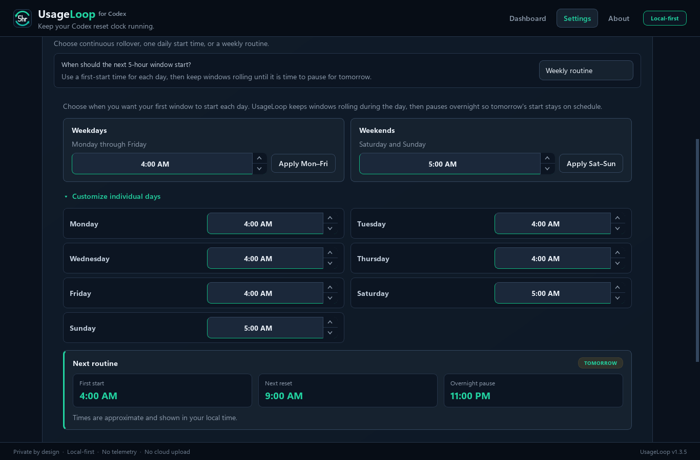
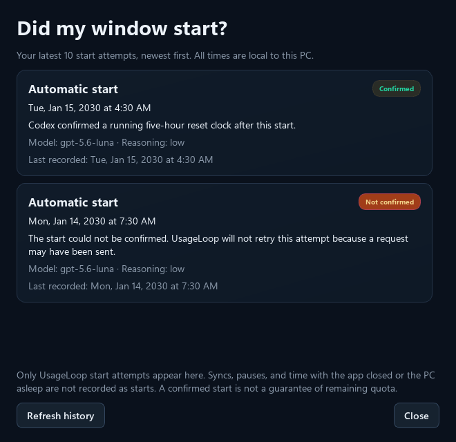
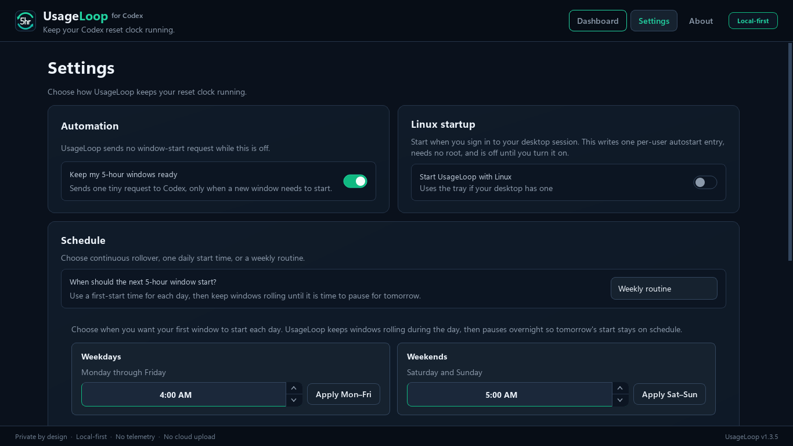

# UsageLoop

[](https://github.com/benthompsondev/usageloop/releases/latest) [](https://github.com/benthompsondev/usageloop/actions/workflows/verify.yml) [](LICENSE)

**Plan when your Codex day starts.**

For Codex accounts with a five-hour usage window, the next reset clock normally
starts with the first request after the previous window ends. Start at 7:00 AM
and the next reset is around noon. Start at 4:00 AM and it is around 9:00 AM.

UsageLoop can start that next window with one small Codex request, which uses
some of your subscription allowance. Pick one time, separate weekday and
weekend times, or a different time for every day of the week. It keeps windows
rolling through the day, pauses overnight, and shows you when the next one
begins.

UsageLoop does not add quota or bypass limits. It starts the normal next window
you were going to receive anyway, earlier. It is a local-first desktop app for
Windows and Linux, built from one shared core.

**[Download for Windows](https://github.com/benthompsondev/usageloop/releases/latest/download/UsageLoop-Setup.exe)**
· **Linux: release candidate on this branch**
· [Release notes](https://github.com/benthompsondev/usageloop/releases/latest)
· [Report a problem](https://github.com/benthompsondev/usageloop/issues/new?template=bug_report.yml)

Requires Codex already installed and signed in, as either the Codex desktop app
or the Codex CLI. Your computer must be awake and signed in, with UsageLoop
running, for a scheduled start. The Windows installer is unsigned;
[check the download and SmartScreen guidance](#windows) before running it. If
your account has no five-hour window, this scheduling feature does not apply.


Screenshots show v1.3.0 on Windows with synthetic usage data. The Linux build
runs the same UI.

- Native x64 Windows and Linux builds with a quiet system tray mode
- Free and open source under the MIT license
- No API key, telemetry, cloud account, or administrator rights
- Never reads Codex credentials, prompts, responses, or conversations
- Automation and Windows startup are off by default

[Website](https://benthompsondev.github.io/usageloop/) ·
[Set your weekly routine](#set-your-weekly-routine) · [Install](#install) ·
[See what it does](#what-usageloop-does) ·
[Review privacy and trust](#privacy-and-trust) · [Understand how it works](#how-it-works)
· [Get help](#get-help-and-share-feedback)

## Set your weekly routine

Most people do not want the same start time seven days a week. UsageLoop lets
you set a first-start time for weekdays and another for weekends, then override
any individual day if you want to.



- **Weekdays** and **Weekends** each hold one first-start time. Set the time,
  press **Apply Mon–Fri** or **Apply Sat–Sun**, and the button confirms with
  **Applied**.
- **Customize individual days** opens a row per day when you want Wednesday to
  differ from the rest of the week.
- **Next routine** tells you what is actually going to happen: the **first
  start**, the **next reset** five hours later, and when the **overnight pause**
  begins.

After the first start of the day, UsageLoop keeps windows rolling as each one
resets. It stops starting new windows in the evening so the next morning begins
on the time you chose rather than drifting later each day.

If you want something simpler, the other two choices are still there:
**Continuous** starts a new window as soon as the current one resets, and
**Once each day** uses a single daily start time.

### Take a day off without losing your routine

Choose **Pause until tomorrow** on the Dashboard, or right-click
the tray icon and choose **Pause until** the displayed date and time. This works
with **Weekly routine** and **Once each day**, not **Continuous**. The pause ends
at tomorrow's configured first-start time.

Automation stays enabled, but automatic starts wait until that exact time.
Your routine stays unchanged, and the pause survives restarting the app or PC.
Changing your schedule does not move an existing pause. **Resume automation**
ends it early; turning Automation off cancels it and leaves automation off.
Pause is unavailable while an operation is already running.

At the resume time, the normal scheduler and safety checks take over. It is not
a promise that a request will be sent at that moment.

### Check what happened while you were away

Open **Recent starts** from the Dashboard or tray to see the last ten window-start
attempts. Each entry shows when it happened, whether it was automatic or a manual
first start, and whether Codex confirmed the new reset clock.



An uncertain outcome stays **Not confirmed**, with an explanation of why
UsageLoop will not retry it. **Not sent** means no start request reached Codex.
**Refresh history** only rereads local records; it does not sync usage or send a
request. Your existing history is available after upgrading.

This is a record of start attempts, not a list of missed appointments. It does
not invent entries for pauses, Sync, or time when the app was closed or the PC
was asleep. A confirmed start does not guarantee that quota is still available.

## Install

### Windows

You need:

- an x64-compatible Windows PC;
- the Codex desktop app or Codex CLI installed and already signed in.

Download the latest stable per-user installer and its matching checksum:

- [UsageLoop-Setup.exe](https://github.com/benthompsondev/usageloop/releases/latest/download/UsageLoop-Setup.exe)
- [UsageLoop-Setup.exe.sha256](https://github.com/benthompsondev/usageloop/releases/latest/download/UsageLoop-Setup.exe.sha256)

The installer does not need administrator rights or change the global PATH.
Already installed? Open **Settings**, scroll to **Updates**, and choose
**Check for updates**. Checks and installation are manual; UsageLoop does not
update itself in the background.

> [!IMPORTANT]
> The current installer is not code-signed. Windows Defender SmartScreen may
> show **Windows protected your PC** or **Unknown publisher**. Download it only
> from this repository's Releases page and verify the SHA-256 checksum before
> continuing. If your organization blocks unsigned apps, do not bypass that
> policy.

To verify the two downloaded files in PowerShell:

```powershell
$expected = (Get-Content .\UsageLoop-Setup.exe.sha256).Split()[0]
$actual = (Get-FileHash .\UsageLoop-Setup.exe -Algorithm SHA256).Hash.ToLower()
$actual -eq $expected
```

The result must be `True`. After checking the source and checksum, Windows
normally exposes **More info → Run anyway** on systems that permit unsigned
apps.

### Linux

You need:

- an x86_64 Linux desktop with a graphical session (X11 or Wayland);
- the Codex desktop app or Codex CLI installed and already signed in.

UsageLoop finds either one on its own. It checks `$CODEX_HOME` (default
`~/.codex`) for the binary the Codex CLI manages, then follows the Codex desktop
app's own launcher to wherever it is installed, then falls back to `codex` on
`PATH`. The desktop app puts no `codex` on `PATH` at all, so searching `PATH`
alone would report Codex as missing on a machine that clearly has it.

The current Linux candidate is built from this branch; it is not attached to
the Windows v1.3.0 release. Build it using the source instructions below,
then verify, extract, and run the resulting archive:

```bash
sha256sum -c UsageLoop-*-linux-x86_64.tar.gz.sha256
tar -xzf UsageLoop-*-linux-x86_64.tar.gz
cd UsageLoop-*-linux-x86_64
./UsageLoop/UsageLoop
```

To add it to your application menu, run the bundled per-user installer. It needs
no root, touches no system files, and changes no `PATH`:

```bash
./install.sh
```

`./install.sh --uninstall` removes the app, its launcher, and any autostart
entry. It leaves your settings and start history alone.



The Dashboard, schedule, Pause, and Recent starts are the same as the Windows
screenshots above. Only two things differ: the startup card names your desktop
session instead of Windows, and there is no in-app updater.

ARM64 is not built yet. Nothing in the app blocks it, it just has not been built
or tested, so there is no artifact to download.

**Tray.** UsageLoop uses the system tray when your desktop provides one. GNOME
does not ship one by default; without an AppIndicator extension UsageLoop runs
as a normal window, and closing the window exits the app. Pause, Recent starts,
and Sync are all on the Dashboard, so nothing is tray-only.

**Updates.** Open **Settings** and press **Check for updates**. UsageLoop asks
GitHub only when you press it, shows what changed, downloads the Linux archive,
and checks its SHA-256 against the published checksum before doing anything with
it. If you installed with `install.sh`, **Install and restart** finishes the job:
UsageLoop closes, the new version is unpacked into place, and it reopens. If you
are running from an extracted folder instead, it hands you the exact command to
run yourself. Your settings and history are kept either way.

**If Codex lives somewhere unusual**, such as a Nix, Flatpak, or hand-built
layout, you can point UsageLoop straight at it. You should not need this for a
normal install:

```bash
USAGELOOP_CODEX_EXECUTABLE=/path/to/codex ./UsageLoop/UsageLoop
```

## What UsageLoop does

On accounts that expose a five-hour window, its clock normally starts when you
use Codex. If the current window ends while you're away, the next reset clock
normally waits until you come back and use Codex again.

UsageLoop can start that next window for you with one minimal request. Your
current window ends at 1:00 AM. UsageLoop starts the next one at 4:00 AM. When
you sit down at 7:00 AM, that reset clock has already been running for three
hours, so your next full reset arrives around 9:00 AM instead of noon.

You can still work at 7:00 AM in either case if you have allowance left. The
benefit is an earlier next reset if you use up that window, not extra quota or
five hours of continuous model work. The weekly limit still applies. OpenAI
controls these limits, and account behavior can change; check the limits your
Codex app actually shows.

The dashboard shows:

- whether the five-hour reset clock is running;
- the local countdown and absolute reset time;
- the last-known five-hour usage percentage;
- the last-known weekly usage and safety state;
- the next scheduled action and the last automatic action UsageLoop took.

Automation has three local schedule choices:

- **Continuous** starts the next window after the reset and safety buffer, so
  windows roll continuously.
- **Once each day** waits until your chosen local time after a window ends.
- **Weekly routine** uses a first-start time per day, with quick weekday and
  weekend groups and optional per-day overrides. Windows keep rolling after the
  first start and pause overnight so the next day begins on schedule. See
  [Set your weekly routine](#set-your-weekly-routine).

All three run on your PC's local clock. If the PC is asleep at the selected
time, UsageLoop catches up once after wake or restart. If a Codex window is
still active, it waits for the next scheduled time rather than starting early.
Daylight-saving changes use the Windows local clock.

The countdown moves locally. It does not poll Codex to make the UI look live.
Usage percentages are snapshots from the last real observation.

**Sync usage** is the exception you control. Pressing it takes four read-only
Codex observations over about 30 seconds, then refreshes the five-hour and
weekly snapshots. It never selects a model or starts a Codex turn.

## First run

1. Open UsageLoop and confirm Codex is detected.
2. Review the cached five-hour and weekly state.
3. In Settings, choose **Continuous**, **Once each day**, or **Weekly routine**,
   then turn on **Keep my 5-hour windows ready**. Weekly routine gives each day
   its own first-start time: set the
   weekday and weekend times, then check the **Next routine** card before you
   leave.
4. On a true first run, choose **Start my first window now**. This explicit
   action uses the same evidence and weekly checks as an automatic start.
5. Leave UsageLoop in the tray. Automation and Windows startup stay off until
   you enable them.

Windows startup runs UsageLoop in your signed-in desktop session. If the PC
sleeps, the app catches up after wake. If it is powered off or you are signed
out, it catches up the next time you sign in. UsageLoop does not install a
Windows service or store your Windows password.

Settings contains the schedule, Windows startup, manual updates, and collapsed
technical diagnostics. Update checks contact GitHub only after a button click
and never affect quota.

## Privacy and trust

Codex owns authentication and network communication. UsageLoop launches the
installed `codex app-server` locally, but it does not:

- read `auth.json`, tokens, credentials, email, or account identifiers;
- call private ChatGPT endpoints such as WHAM;
- scrape the Codex or ChatGPT UI;
- record prompts, model responses, conversations, or thread contents;
- send telemetry;
- require an API key or administrator rights.

Safe local history contains only timestamps, window duration, usage, reset
times, classifier evidence, attempt states, and sanitized error categories.
Automation and Windows startup are both off on a new install. While automation
is off, UsageLoop performs no provider-triggering work.

The source is public, releases include a SHA-256 checksum, and the Windows test
and packaging workflow is visible in [GitHub Actions](https://github.com/benthompsondev/usageloop/actions/workflows/verify.yml).
The installer is still unsigned, so the checksum and public build process are
useful verification signals, not a substitute for a trusted code-signing
identity.

Suspected vulnerabilities can be reported privately through the
[security policy](SECURITY.md).

UsageLoop is an independent open-source project. It is not affiliated with,
endorsed by, or sponsored by OpenAI.

## How it works

UsageLoop completes the normal local app-server initialization handshake. It
reads subscription windows through `account/rateLimits/read`, identifies
windows by their actual duration, and classifies several observations instead
of trusting one timestamp.

When automation is enabled, a rollover start is allowed only after:

- four strong observations show the five-hour window is unanchored;
- the known reset boundary and 60-second safety buffer have passed;
- the official weekly Codex window is present and below 99% used;
- no attempt has already been reserved for that opportunity;
- the current Codex capabilities pass a lightweight compatibility probe.

The start uses one ephemeral `thread/start` plus one `turn/start` through the
same local app-server. UsageLoop prefers **GPT-5.6 Luna**, at the lowest reasoning
effort that the installed Codex catalog supports, with standard service instead
of Fast mode. The request asks for only “OK” and no tool use.

The model must be visible, support text, and have no retirement/upgrade hint.
If Luna is unavailable, GPT-5.4 mini is allowed only if it still meets those
checks. If neither qualifies, UsageLoop sends nothing. It never falls back to
Astra or Sol just because Codex recommends them as the general default, and it
does not assume that an unknown successor is cheap.

**Recent starts** shows the saved model and reasoning for each attempt.
`sentinel doctor` previews the live selection without sending a model request.
Codex controls usage accounting; a short prompt or lightweight model is not a
promise of a particular percentage. Success still requires fresh rate-limit
observations showing a fixed reset timestamp.

If a request may have been sent, UsageLoop never retries it automatically.

## Get help and share feedback

- [Report a problem](https://github.com/benthompsondev/usageloop/issues/new?template=bug_report.yml)
- [Request a feature](https://github.com/benthompsondev/usageloop/issues/new?template=feature_request.yml)

Bug reports can include the privacy-safe summary from **Settings → Advanced →
Copy this summary**. Do not paste credentials, Codex prompts or responses,
conversations, account information, auth files, or unrelated logs.

UsageLoop helping you? Consider starring the repository. It helps other Codex
users find the project.

## Advanced use and development

<details>
<summary><strong>CLI and classifier reference</strong></summary>

The observer and guarded engine are also available from PowerShell:

```powershell
.\sentinel.ps1 doctor
.\sentinel.ps1 status --json
.\sentinel.ps1 sample
.\sentinel.ps1 watch
.\sentinel.ps1 chain --dry-run
.\sentinel.ps1 bootstrap --dry-run
```

`doctor`, `status`, and `sample` are read-only. A real bootstrap requires
`bootstrap --confirm`. The desktop app uses the same core.

Classifier states:

- `ANCHORED`: reset timestamp stays fixed while remaining time decreases.
- `UNANCHORED`: reset timestamp advances with wall time and stays about five
  hours away.
- `ABSENT`: no approximately five-hour window is exposed.
- `EXHAUSTED`: the relevant window explicitly reports a blocked state.
- `UNKNOWN`: evidence is insufficient, malformed, contradictory, or ambiguous.

False `UNKNOWN` is preferred over false certainty. Rate-limit semantics are
evolving implementation behavior and must be measured, not assumed.

</details>

## Local data and removal

On Windows, state is stored under `%LOCALAPPDATA%\UsageLoop`. The installer
removes its per-user startup entry and installed files. To remove all remaining
local data after uninstalling:

```powershell
Remove-Item -LiteralPath "$env:LOCALAPPDATA\UsageLoop" -Recurse -Force
```

On Linux, state is stored under `${XDG_STATE_HOME:-~/.local/state}/usageloop`,
and the optional autostart entry is a single file at
`${XDG_CONFIG_HOME:-~/.config}/autostart/usageloop.desktop`. `install.sh
--uninstall` removes the app and both entries. To remove the remaining data:

```bash
rm -rf "${XDG_STATE_HOME:-$HOME/.local/state}/usageloop"
```

Only run those commands if you want to discard saved reset evidence and trigger
reservations.

<details>
<summary><strong>Build from source</strong></summary>

On Windows:

```powershell
pwsh -NoProfile -File .\scripts\setup.ps1
pwsh -NoProfile -File .\scripts\verify.ps1
pwsh -NoProfile -File .\scripts\build-windows.ps1
```

The build creates:

```text
dist\UsageLoop\UsageLoop.exe
dist\UsageLoop-Setup.exe
dist\UsageLoop-Setup.exe.sha256
```

On Linux:

```bash
python -m venv .venv && .venv/bin/python -m pip install --editable ".[build,test]"
QT_QPA_PLATFORM=offscreen .venv/bin/python -m unittest discover -s tests -q
PYTHON=.venv/bin/python ./scripts/build-linux.sh
```

The build creates:

```text
dist/linux/UsageLoop-<version>-linux-x86_64/
dist/UsageLoop-<version>-linux-x86_64.tar.gz
dist/UsageLoop-<version>-linux-x86_64.tar.gz.sha256
```

The full test suite runs on both hosts and both hosts' behavior is covered from
either one, so a Linux run still catches a Windows regression.

For focused development checks:

```powershell
.\.venv\Scripts\python.exe -m unittest discover -s tests -q
.\.venv\Scripts\python.exe -m compileall -q src tests
```

See [PROJECT_SPEC.md](PROJECT_SPEC.md) for the behavioral contract,
[docs/RELEASING.md](docs/RELEASING.md) for the release checklist, and
[docs/LINUX_HANDOFF.md](docs/LINUX_HANDOFF.md) for where the Linux build stands
and what is still unverified.

</details>

## More of my work

The other local-first apps are [CloakScan](https://github.com/benthompsondev/cloakscan),
which strips secrets out of code and logs before you share them, and
[SignalSpace Finance](https://github.com/benthompsondev/ledger-local-finance),
private personal finance for Windows. My PowerShell automation portfolio is
[Enterprise PowerShell Systems](https://github.com/benthompsondev/enterprise-powershell-systems).

The rest is on [benthompsondev.github.io](https://benthompsondev.github.io/).
